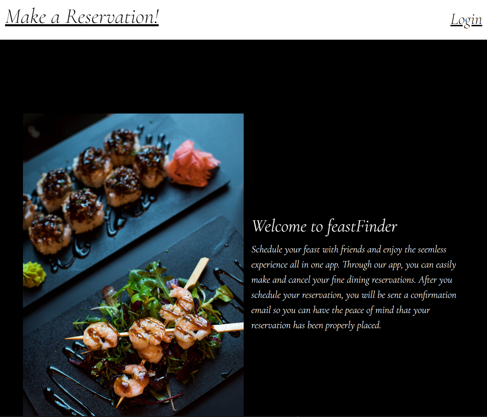
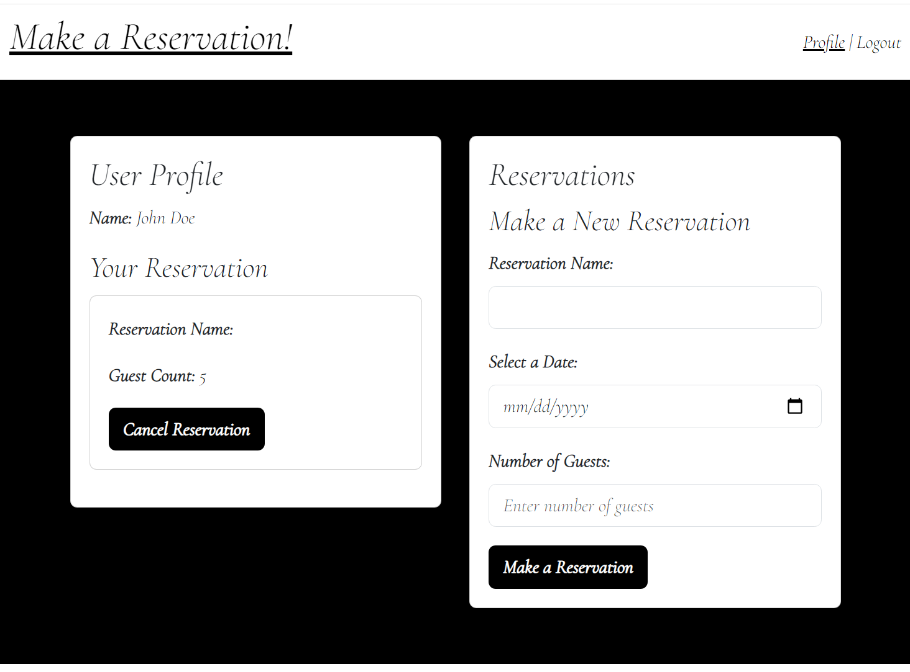

# feastFinder - Restaurant Reservation System

## About
This application helps in managing customers and their reservations at your restaurant. It features a user-friendly interface for customers to make or cancel reservations, and an Admin page for managing reservations on behalf of customers. Enhanced security features ensure the safety and privacy of user data.

## Installation

To run this application, install the following npm packages:
- bcrypt
- connect-session-sequelize
- dotenv
- express
- express-handlebars
- express-session
- mysql2
- nodemailer
- sequelize
- nodemailer

## Usage

The application is designed to efficiently manage restaurant patrons and their reservations. You can customize settings like maximum capacity and reservation availability to align with your restaurant's needs.

### Features:
- User Registration and Authentication
- Make Reservation, Cancel Reservation
- Secure Password Handling with Hashing
- Session Timeout for Additional Security
- Main Branch Protection
- Environment Variables for Sensitive Data

### Screenshots

## Contributing and Contact

Development Team:
- Brennan Mitchell: [GitHub](https://github.com/mrwait-music)
- Alex Fontana: [GitHub](https://github.com/afontana405)
- Mohammad Alam: [GitHub](https://github.com/alamm01)
- Tonya Morris: [GitHub](https://github.com/misschootemup)

## Project Location
- GitHub: [GitHub](https://github.com/alamm01)
- Deployed: [Heroku](https://feastfinder-29c2a8dddaa0.herokuapp.com/)

## License

Open source student project.
